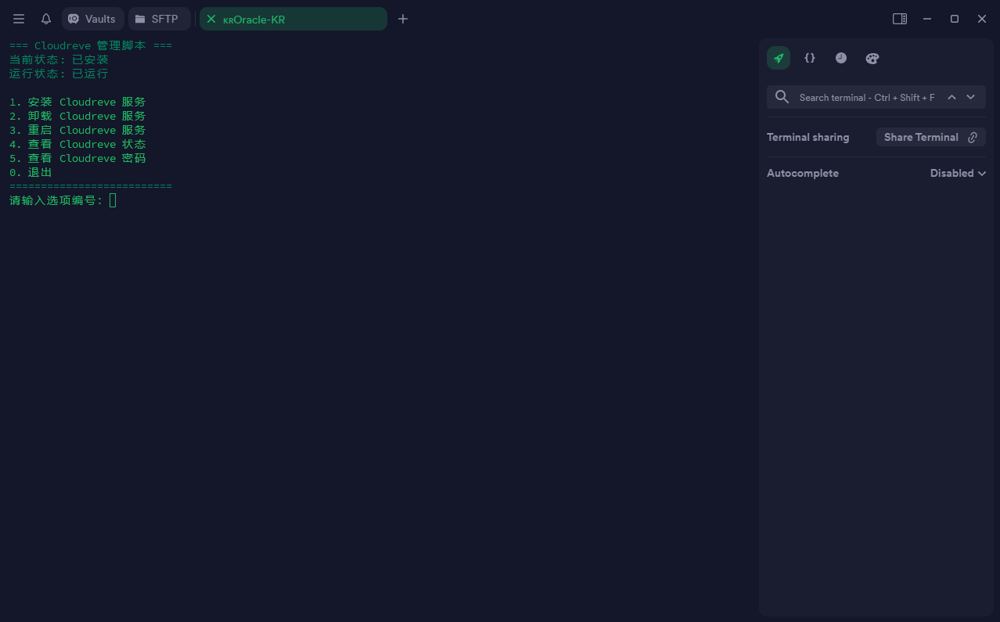

## 终端预览



## 一键脚本
```
bash <(curl -fsSL https://raw.githubusercontent.com/passeway/Cloudreve/main/cloudreve.sh)
```
## 详细说明
- Cloudreve 默认会监听5212端口，你可以在浏览器中访问http://服务器IP:5212进入 Cloudreve。

- Cloudreve 在首次启动时，会创建初始管理员账号，请注意保管管理员密码，此密码只会在首次启动时出现,如果您忘记初始管理员密码，需要删除同级目录下的cloudreve.db，重新启动主程序./cloudreve 以初始化新的管理员账户。

## 项目地址：https://surge.mitsea.com/others/snell-server
